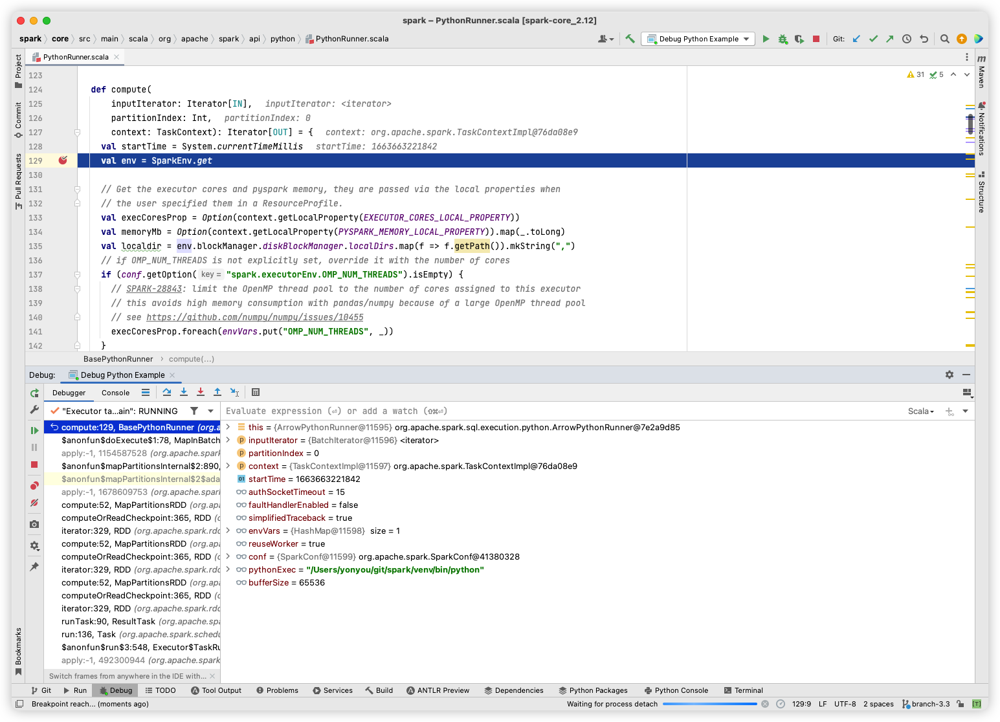

之前写过一篇文章来介绍如何构建 Spark 源码本地的 Debug 环境 （详情看[这里](https://waltyou.github.io/Spark-Source-Code-Build-And-Run-In-Idea-Intellij/)），但是对于 PySpark 的调试环境略有不同，再来一篇文章介绍一下。

<!-- more -->
---


* 目录
{:toc}
---

## 提交 Python SDK

下载源代码，用 IDEA 打开，首先添加 Python SDK:


  


  


```shell
source venv/bin/activate
pip install -r dev/requirements.txt

./build/mvn -DskipTests clean package -Phive
cd python; python setup.py sdist
```

## Run PySpark

Run `pi.py`

  

  

## Debug Python thread in PySpark

很简单，和debug 其他程序一样，只要设置 BreakPoints，然后点击debug 按钮就可debug：

  

## Debug Java thread in PySpark

> 在此之前，可以先去了解一下 pyspark基础的架构，比如[这一篇](https://www.mobvista.com/cn/blog/2019-12-27-2/)。

这一部分复杂一些，需要手动去设置一些属性，具体如下图所示：
  

- Main Class: org.apache.spark.deploy.SparkSubmit
- Program Arguments: --master local examples/src/main/python/pi.py
- Environment variables: PYSPARK_DRIVER_PYTHON=/Users/yonyou/git/spark/venv/bin/python;PYSPARK_PYTHON=/Users/yonyou/git/spark/venv/bin/python

最重要的是我们需要设置两个环境变量 `PYSPARK_DRIVER_PYTHON` 和 `PYSPARK_PYTHON` 告诉 pyspark 应该用哪个 python。因为我用 IDEA 默认创建了一个 Python venv, 而且在这个 venv 里 install 了所有 pyspark 的依赖，所以我用这个。当然如果你默认的python环境有所有pyspark的依赖，也可以不设置这两个环境变量。

最终效果：
  
