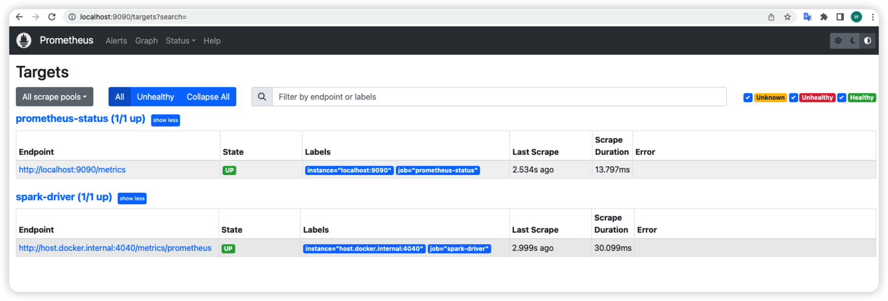
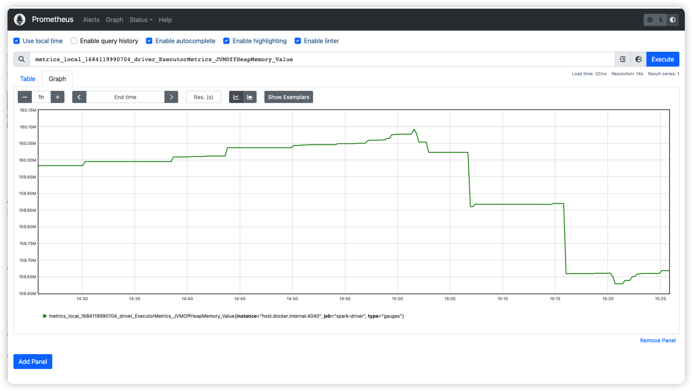
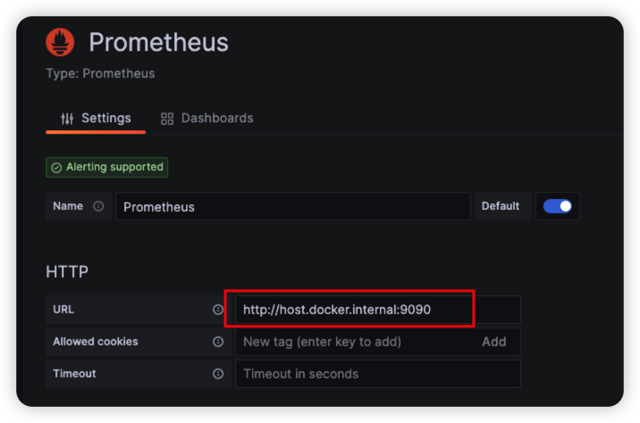
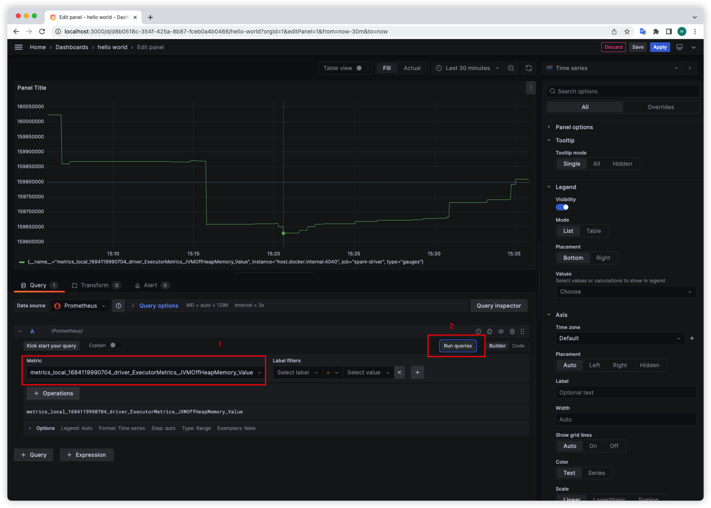

Spark Metrics is useful if we debug our Spark applications and integetrating with Prometheus and Grafana is a common way to show it.

<!-- more -->

---

* Outline
{:toc}
---

## Background

When we upgrade to Spark 3.0 from 2.4, we found it change the default behevior to compare the date. So it introduce a issue that Spark will load all Hive partitions and do filter in memory instead of doing filter when loading Hive Partitions. Check this two issues [SPARK-27638](https://issues.apache.org/jira/browse/SPARK-27638) and [SPARK-40610](https://issues.apache.org/jira/browse/SPARK-40610), you can learn more.

When I debug this issue, I found there is a Spark Metrics called [partitionsFetched.count
](https://spark.apache.org/docs/latest/monitoring.html#metrics) is used to monitor the number of Spark load Hive Partitions. If I can compare this metric between Spark 3 job and Spark 2 job, I can find the root cause early.

This why this document come out.

## Preparation

### 1. Spark Metrics

Go to offical websit to learn more: https://spark.apache.org/docs/latest/monitoring.html#metrics

### 2. Prometheus

Offical websit: https://prometheus.io/
Simply introudction: From metrics to insight, Power your metrics and alerting with the leading open-source monitoring solution.

### 3. Grafana

offical websit: https://grafana.com/
Simply introudction: Operational dashboards for your data here, there, or anywhere

## Let's Go

> Note: this doc only be test in local env instead of prod env.

### 1. Spark side

#### Enable Prometheus Metrics in Spark job

In Spark source code, there is a template configuration file `conf/metrics.properties.template`. Copy it as `metrics.properties`. And uncomment the configurations related Prometheus:

```text
# Example configuration for PrometheusServlet
*.sink.prometheusServlet.class=org.apache.spark.metrics.sink.PrometheusServlet
*.sink.prometheusServlet.path=/metrics/prometheus
#master.sink.prometheusServlet.path=/metrics/master/prometheus
#applications.sink.prometheusServlet.path=/metrics/applications/prometheus
```

#### Run a Spark Job

You can build the Spark Source code in your local machine, detail can follow [here](https://waltyou.github.io/Spark-Source-Code-Build-And-Run-In-Idea-Intellij/).
After the Spark source code build successfuly, we can run its exmaples. Let's choose `SparkSQLExample.scala` as an example. 

But we need do two modifications about the code. One is add configuration to set Metics configuration file. Another is adding `while(true) {}` to keep the spark session running so that we can monitor it in Prometheus. The `main` function looks like:

```scala
  def main(args: Array[String]): Unit = {
    // $example on:init_session$
    val spark = SparkSession
      .builder()
      .appName("Spark SQL basic example")
      .config("spark.master", "local[*]")
      // set spark.metrics.conf
      .config("spark.metrics.conf", "/the/path/of/metrics.properties")
      .config("spark.some.config.option", "some-value")
      .getOrCreate()
    // $example off:init_session$

    runBasicDataFrameExample(spark)
    runDatasetCreationExample(spark)
    runInferSchemaExample(spark)
    runProgrammaticSchemaExample(spark)

    // we don't want to close the spark session
    while(true) {}
    spark.stop()
  }
```

When the Spark job is running, you can visit `http://localhost:4040/metrics/prometheus/` in the browser. You can see some metrics like:

```text
......
metrics_local_1684119990704_driver_BlockManager_disk_diskSpaceUsed_MB_Number{type="gauges"} 0
metrics_local_1684119990704_driver_BlockManager_disk_diskSpaceUsed_MB_Value{type="gauges"} 0
metrics_local_1684119990704_driver_BlockManager_memory_maxMem_MB_Number{type="gauges"} 8558
metrics_local_1684119990704_driver_BlockManager_memory_maxMem_MB_Value{type="gauges"} 8558
metrics_local_1684119990704_driver_BlockManager_memory_maxOffHeapMem_MB_Number{type="gauges"} 0
metrics_local_1684119990704_driver_BlockManager_memory_maxOffHeapMem_MB_Value{type="gauges"} 0
metrics_local_1684119990704_driver_BlockManager_memory_maxOnHeapMem_MB_Number{type="gauges"} 8558
metrics_local_1684119990704_driver_BlockManager_memory_maxOnHeapMem_MB_Value{type="gauges"} 8558
metrics_local_1684119990704_driver_BlockManager_memory_memUsed_MB_Number{type="gauges"} 0
metrics_local_1684119990704_driver_BlockManager_memory_memUsed_MB_Value{type="gauges"} 0
......
```

### 2. Setup Prometheus

#### Prometheus

Create `prometheus.yml` with:

```yml
global:
  scrape_interval: 3s

scrape_configs:
  - job_name: 'spark-driver'
    # default metrics_path is `/metrics`, need change it to match the config in Spark metrics.properties
    metrics_path: /metrics/prometheus
    static_configs:
      # For convenience, I will use docker to run it. If you want to run them without docker, please replace `host.docker.internal` with the real IP address
      - targets: ['host.docker.internal:4040']
  - job_name: 'prometheus-status'
    static_configs:
      - targets: ['localhost:9090']
```

Learn more from [here](https://prometheus.io/docs/prometheus/latest/configuration/configuration/).

### 3. Start Prometheus and Grafana docker

Create `docker-compose.yml`:

```yml
version: "3"
services:
  prometheus:
    image: prom/prometheus
    container_name: prometheus
    volumes:
      - ./prometheus.yml:/etc/prometheus/prometheus.yml
    ports:
      - "9090:9090"
  grafana:
    image: grafana/grafana
    container_name: grafana
    ports:
      - 3000:3000
    volumes:
      - grafana_data:/var/lib/grafana

volumes:
  grafana_data:
```

In the same folder, start the containers:

```shell
$ ls
docker-compose.yml prometheus.yml

$ docker-compose up -d

[+] Running 4/4
 ⠿ Network dockers_default        Created                                          0.0s
 ⠿ Volume "dockers_grafana_data"  Created                                          0.0s
 ⠿ Container prometheus           Started                                          0.3s
 ⠿ Container grafana              Started                                          0.3s
```

### 4. Valid result

#### check prometheus

Go `http://localhost:9090/targets?search=` to check if Spark target up.
  

Go `http://localhost:9090/graph?g0.expr=&g0.tab=1&g0.stacked=0&g0.show_exemplars=0&g0.range_input=1h` to fetch one metric to see its values. Search the metric name in the `Expression` text box you want to check then click `Execute`. Then choose the `Graph` tab. It will show like below:

  

### check Grafana

Open `http://localhost:3000/` in browser. The default username/password is admin/admin.

Firstly, we need create a Prometheus data source in Grafana. You can follow this [Grafana offical document](https://grafana.com/docs/grafana/latest/datasources/prometheus/) to set up it.

Here only one thing need to care about is that we run them in Docker so you need set the URL as `http://host.docker.internal:9090` like:
  

When adding the data source, we can create the Dashboard to display the metrics.
  

After everything set up as you wish, You can click `Save` in the upper right corner.

## Further

* Learn more use case about Grafana
* Try to deploy the dockers to Prod VM.
