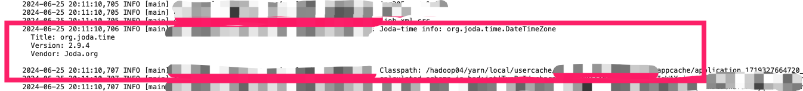
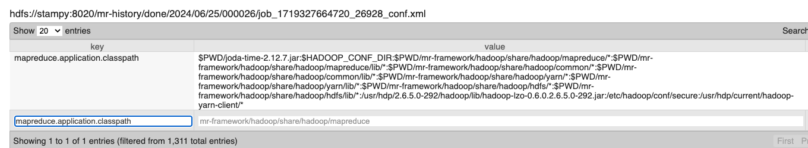

最近工作中遇到一个关于MapReduce ClassPath的问题，记录一下。

<!-- more -->

---

* Outline
{:toc}
---

## 背景

公司有一个时间久远的大数据集群，Hadoop 版本为 2.x.x，在上面有一组运行了接近10年的MapReduce jobs，给公司提供一大批非常基础的数据指标。
而我负责维护它的工作，大部分时间它都运行良好，但是偶尔会有一些奇怪的问题发生。比如最近的job 突然开始失败，下面是报错信息：

```log
java.lang.IllegalArgumentException: The datetime zone id 'America/Nuuk' is not recognised
	at org.joda.time.DateTimeZone.forTimeZone(DateTimeZone.java:374)
    ....
```

## 开始调查

先在本地code中写一个UT进行测试，发现是可以复现这个问题的。然后根据错误日志，应该是第三方库 joda-time 无法识别这个 'America/Nuuk'。 
到[Maven Repo](https://mvnrepository.com/artifact/joda-time/joda-time)中搜索了Joda-time，它最新的版本已经到了2.12.7. 然而我们code中使用的是May 27, 2016 发布的 2.9.4.

OK，看起来像是版本问题，那么升级它就好了。在 pom.xml 中把版本改为 2.12.7后，刚刚失败的 UT 就可以完美跑过。good，很简单的一个问题，接下来开始打包部署到prod，然后重启Mapreduce job就完成了。

## 奇怪的事情发生了

当新的jar包部署到prod后，Mapreduce Job依然是以还是同样的错误失败。第一想法是自己的jar包出了问题，又或是部署过程中犯了低级错误，比如copy错jar。 然而仔细检查后，发现打包部署过程都是正确的，确确实实是新的jar包会产生同样的错误。

既然确定了jar 包中有新版本的 class，那么为什么Mapreduce job还是用旧的呢？ 熟悉java的朋友可能已经猜到问题所在了， 那就是 classpath。（不熟悉的朋友可以自己搜一下）

## 验证自己猜测

在MapReduce job的 code中添加下列code，就可以把运行时候的所用的joda-time 版本，以及所有的 classpath 打印出来了。
```java
LOG.info("Joda-time info: " + getClassVersion(DateTimeZone.class));
String classPath = System.getProperty("java.class.path");
LOG.info("Classpath: " + classPath);
....

public static String getClassVersion(Class<?> clazz) {
    Package p = clazz.getPackage();
    String s = String.format("%s%n  Title: %s%n  Version: %s%n  Vendor: %s%n",
            clazz.getName(),
            p.getImplementationTitle(),
            p.getImplementationVersion(),
            p.getImplementationVendor());
    return s;
}
```
Log的查询可以到 Yarn 的Resource Manager 里面查看。效果如下：


把整个classpath copy出来发现，里面的确是有两个版本的 joda-time，而且旧版本的出现在新版本之前，怪不得java 会load 旧的jar。

## 如何解决？

既然是因为classpath旧版本的出现在新版本之前，那么只需要把它提前就好。但又来一个问题，打印出来的classpath是如何组成的？code 以及运行脚本中并没有引入旧版本的操作啊。

经过搜索和调查发现，这个旧的joda-time jar 是通过 Hadoop config `mapreduce.application.classpath` 引入的。那我们只需要在Mapreduce job中修改这个config就好了：

```java
conf.set("mapreduce.application.classpath", "$PWD/joda-time-2.12.7.jar:" + conf.get("mapreduce.application.classpath"));
```

修改后效果如下：


重新打包部署运行，job 成功运行！

## 总结

joda-time 本身的升级不是个值得记录的问题，但是整个调查的过程，应该是可以通用到其他class not found 或者 java 程序总是load 不对class 的问题。

## Reference

- https://hadoop.apache.org/docs/r3.2.0/hadoop-mapreduce-client/hadoop-mapreduce-client-core/DistributedCacheDeploy.html