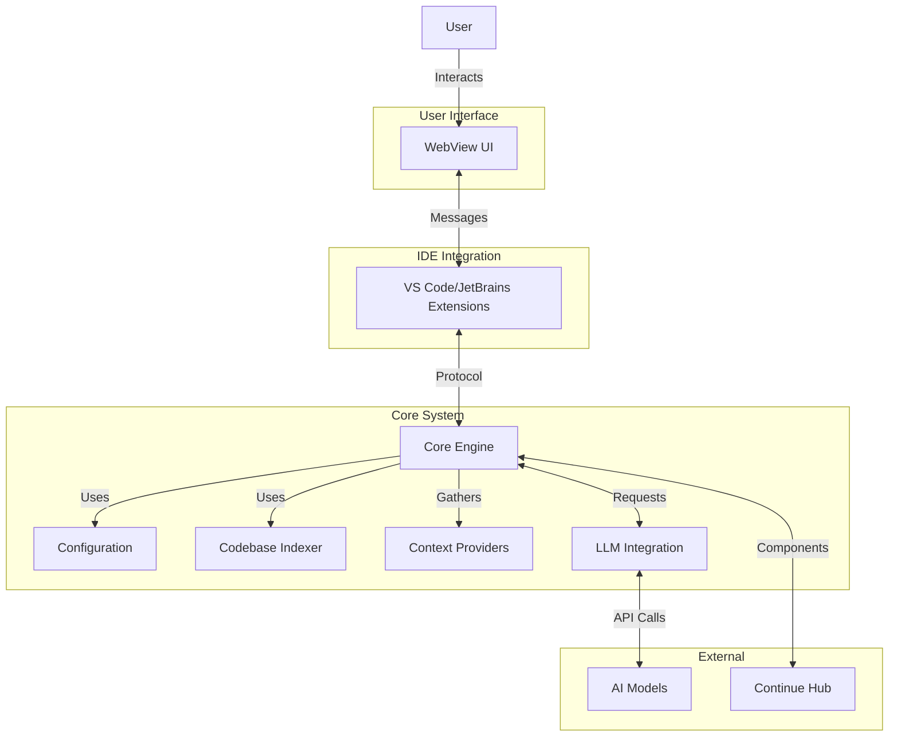
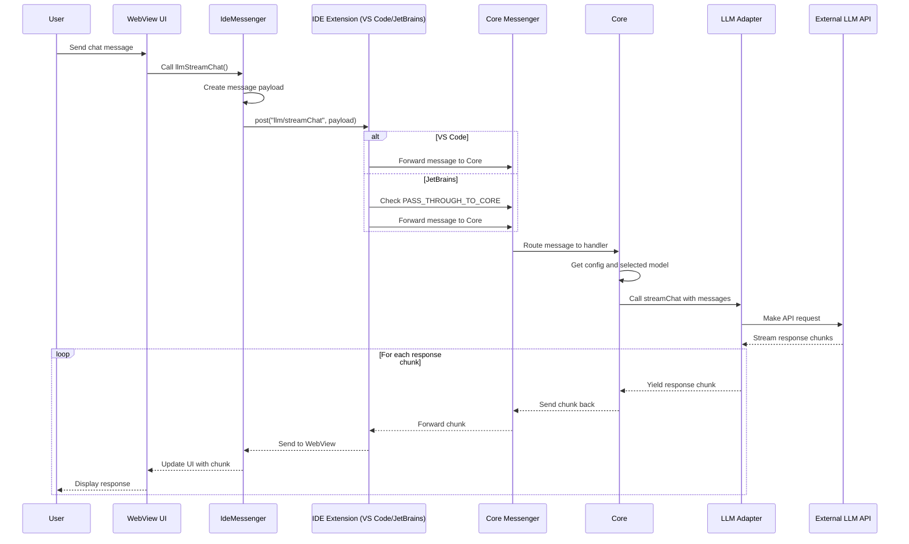

I created a simple project called CAT (Code Assistant Tool) to learn how Continue.dev works.

> **Note:** This project currently only implements the basic messaging architecture and infrastructure. The actual code assistant functionality has not yet been implemented. The focus is on establishing the communication framework between components.


<!-- more -->

---

* Table of Contents
{:toc}
---

## Background

With the development of large language models, the field of code assistant tools has grown rapidly. These tools mainly come in two types: IDE-based (like Cursor, Windsurf) and plugin-based (like Github Copilot, Cline, RooCode, and Continue.dev).

[Continue.dev](https://github.com/continuedev/continue) is a unique plugin because it supports not only VS Code but also JetBrains IDEs. This is possible thanks to its message-passing architecture. Understanding how it works is fascinating, so I created a simple project called CAT (Code Assistant Tool) to learn its approach.

## Introduction to Continue.dev

Continue.dev is an open-source AI coding assistant that integrates into popular IDEs like VS Code and JetBrains. What makes it unique is its architecture - it uses a message-passing system that allows it to use the same core functionality across different IDE platforms.

Key features of Continue.dev include:

1. **Cross-IDE support**: Works with both VS Code and JetBrains IDEs
2. **Extensible architecture**: Modular design with clear separation of concerns
3. **Message-passing system**: Components communicate through well-defined protocols
4. **Open source**: Uses Apache 2.0 license, allowing community contributions and customization

Continue.dev's architecture consists of three main components:

* The core service that handles business logic
* The GUI that provides the user interface
* The IDE extensions that integrate the core and GUI into the development environment


### Architecture



### llm/streamChat Message Passing Process




## Implementation Process of Cat

First, implement each major component

### Core

The Core component is the central processing unit of the CAT project. It's a TypeScript Node.js application responsible for handling message passing between the IDE and other components.

#### Implementation

The Core component is a simple TypeScript class that:

* Handles messages from the IDE through a messaging interface
* Sends responses back to the IDE
* Processes basic commands like ping/pong
* Provides a clean API interface for extensions

The main components of the Core include:

1. **Core Class**: The main service class that handles message processing
2. **Protocol Definitions**: Defines message types and interfaces for communication
3. **Messenger Interface**: Implements communication mechanism between Core and IDE
4. **IDE Interface**: Defines interfaces for interacting with the IDE


#### Key Files

* `core/src/core.ts`: Main Core class implementation
* `core/src/protocol/index.ts`: Protocol definitions for message passing
* `core/src/protocol/messenger.ts`: Message passing interface implementation
* `core/src/ide/index.ts`: IDE interface definitions

#### How It Works

The Core service works by registering message handlers for different message types. When a message is received from the IDE, the Core processes it and sends a response. The basic flow is:

1. IDE sends a message to the Core via the messenger
2. Core processes the message based on its type
3. Core sends a response back to the IDE
4. IDE handles the response

Here's a simple example of how the Core handles a ping message:

```typescript
// Handle ping message
this.messenger.on('ping', ({ data }) => {
  console.log(`Received ping: ${data}`);
  return `pong: ${data}`;
});
```

### Graphical User Interface (GUI)

The GUI component is a React application that provides a user interface for interacting with the Core service. It's designed to work with both VS Code and IntelliJ plugins.

#### Implementation

The GUI is a React application with the following features:

* Uses Redux for state management
* Communicates with the Core service through the IDE extension
* Provides a simple interface for sending messages and displaying responses
* Adapts to different IDE environments (VS Code and JetBrains)

#### Key Files

* `gui/src/App.tsx`: Main React component
* `gui/src/redux/`: Redux store and reducers
* `gui/src/context/IdeMessenger.ts`: Communication interface with the IDE
* `gui/src/hooks/useIdeMessengerRequest.ts`: Custom hook for making requests

#### How It Works

The GUI communicates with the Core service through the message-passing architecture:

1. GUI sends a request to the IDE extension using IdeMessenger
2. IDE extension forwards the request to the Core service
3. Core processes the request and sends a response
4. IDE extension forwards the response to the GUI
5. GUI updates its state and displays the response

The communication flow can be visualized as:

```text
GUI (React) <-> IdeMessenger <-> IDE Extension <-> Core Component
```

#### Running the GUI

For production build:

```bash
npm run build
```

To run the GUI in development mode:

```bash
cd gui
npm install
npm run dev
```

### VS Code Extension

The VS Code extension integrates the Core service and GUI into Visual Studio Code, providing a seamless experience for users.

#### Implementation

The VS Code extension is a TypeScript extension that:

* Hosts the GUI in a webview panel
* Implements the IDE interface for the Core service
* Provides commands for interacting with the Core service
* Handles message passing between the GUI and Core

#### Key Files

* `extensions/vscode/src/extension.ts`: Extension entry point
* `extensions/vscode/src/webview/WebviewPanel.ts`: Webview panel implementation
* `extensions/vscode/src/views/CatWebviewViewProvider.ts`: Webview provider

#### How It Works

The VS Code extension works by:

1. Activating when a command is executed
2. Creating an instance of the Core service
3. Hosting the GUI in a webview panel
4. Handling message passing between the GUI and Core
5. Providing VS Code-specific functionality

#### Running the Extension

To run the extension in development mode:

1. Open the project in VS Code
2. Run the "Run Extension" launch configuration
3. A new VS Code window will open with the extension loaded

#### Example

[](/images/posts/cat-vscode.png) 

### Binary Component

The Binary component provides a standalone executable version of the Core service, allowing it to be used outside of the IDE.

#### Why It's Needed

The Binary component is needed for:

* Running the Core service as a standalone process
* Supporting the IntelliJ plugin with the same Core logic
* Providing better performance in production environments
* Enabling easier debugging during development

#### Implementation

The Binary component is a Node.js application that:

* Creates a messenger (TCP or IPC) for communication
* Initializes the Core service with the messenger
* Handles process lifecycle events
* Provides environment variable configuration

#### Key Files

* `binary/src/index.ts`: Main entry point
* `binary/src/IpcMessenger.ts`: IPC messenger implementation
* `binary/src/TcpMessenger.ts`: TCP messenger implementation

#### How It Works

The Binary component works in two modes:

1. **TCP mode**: Runs as a TCP server, used for development and debugging
2. **IPC mode**: Uses Node.js IPC for production environments

Environment variables control the behavior:

* `CAT_CORE_DEBUG`: Enables TCP mode for debugging
* `CAT_CORE_SERVER`: Runs as a TCP server
* `CAT_CORE_PORT`: TCP port to use (default: 9876)

#### Running the Binary Component

To run the Binary component in development mode:

```bash
cd binary
npm install
npm run dev
```

For production build:

```bash
npm run build
```

### IntelliJ Extension

The IntelliJ extension integrates the Core service and GUI into JetBrains IDEs, providing the same functionality as the VS Code extension but in a different environment.

#### Implementation

The IntelliJ extension is a Kotlin plugin that:

* Hosts the GUI in a browser component
* Implements the IDE interface for the Core service
* Provides tool windows and actions for interacting with the Core
* Handles message passing between the GUI and Core

#### Key Files

* `extensions/intellij/src/main/kotlin/com/cat/intellij/ide/IntelliJIDE.kt`: IDE implementation
* `extensions/intellij/src/main/kotlin/com/cat/intellij/toolwindow/CatToolWindowFactory.kt`: Tool window factory
* `extensions/intellij/src/main/kotlin/com/cat/intellij/service/CatPluginService.kt`: Plugin service

#### How It Works

The IntelliJ extension works by:

1. Creating a tool window with a browser component
2. Loading the GUI into the browser component
3. Handling JavaScript calls from the GUI
4. Communicating with the Core service
5. Providing IntelliJ-specific functionality

#### Running the Extension

To run the extension in development mode:

1. Run `Core Binary` in VS Code
2. Run `Debug Gui` in VS Code
3. Open the project in IntelliJ IDEA
4. Run the Gradle task `runIde`
5. A new IntelliJ window with the plugin loaded will open

#### Example

[](/images/posts/cat-intellij.png) 

## Conclusion

Building the CAT project was a great learning experience for understanding how Continue.dev works. The message-passing architecture provides a clear separation of concerns and allows the same core functionality to be used across different IDE platforms.

Key takeaways from this project:

1. **Modular design**: Separating the Core, GUI, and IDE extensions makes the code more maintainable
2. **Protocol-based communication**: Well-defined protocols make it easier to add new features
3. **Cross-IDE support**: The same core logic can be used in different IDEs
4. **Development experience**: Modern tools like React, Redux, and TypeScript improve the development experience

This project demonstrates how to build a simple yet powerful code assistant tool that can work across different development environments.

## Project Repository

[https://github.com/waltyou/cat](https://github.com/waltyou/cat)
