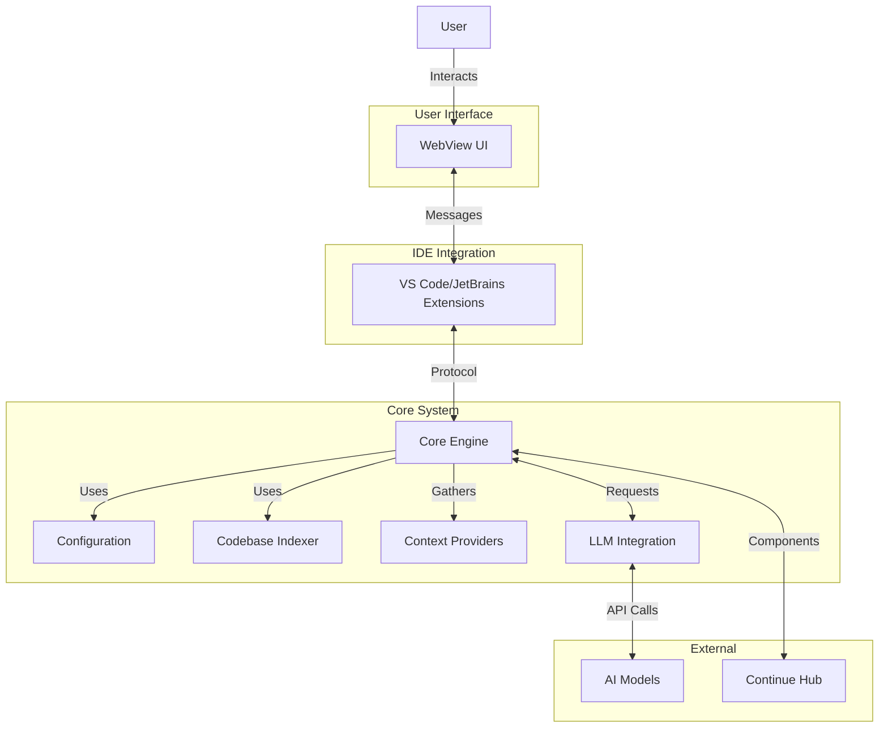
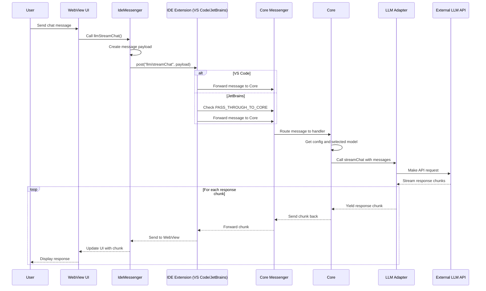

我创建了一个名为CAT（代码助手工具）的简单项目，用来学习Continue.dev的工作原理。

> **注意：** 该项目目前仅实现了基础的消息传递架构和基础设施。尚未实现实际的代码助手功能。重点是建立组件之间的通信框架。


<!-- more -->

---

* 目录
{:toc}
---

## 背景

随着大语言模型的发展，代码助手工具领域发展迅速。这类工具主要有两种：IDE类型（如Cursor、Windsurf）和插件类型（如Github Copilot、Cline、RooCode和Continue.dev）。

[Continue.dev](https://github.com/continuedev/continue) 插件是一个独特的工具，因为它不仅支持VS Code，还支持JetBrains IDE。这得益于它采用的消息传递架构。了解它的工作原理非常有趣，所以我创建了一个名为CAT（Code Assistant Tool）的简单项目来学习它的工作方式。

## Continue.dev简介

Continue.dev是一个开源的AI编码助手，可以集成到流行的IDE中，如VS Code和JetBrains。它的独特之处在于其架构 - 它使用消息传递系统，允许它在不同的IDE平台上使用相同的核心功能。

Continue.dev的主要特点包括：

1. **跨IDE支持**：同时支持VS Code和JetBrains IDE
2. **可扩展架构**：模块化设计，关注点分离清晰
3. **消息传递系统**：组件通过定义良好的协议进行通信
4. **开源**：采用Apache 2.0许可，允许社区贡献和定制

Continue.dev的架构由三个主要组件组成：

* 处理业务逻辑的核心服务core
* 提供用户界面的GUI
* 将core和GUI集成到开发环境中的IDE扩展


### 架构



### llm/streamChat 消息传递的过程




## Cat 的实现过程

首先实现各个主要组件

### 核心(Core)

核心组件是CAT项目的中央处理单元。它是一个TypeScript Node.js应用程序，负责处理IDE和其他组件之间的消息传递。

#### 实现

核心组件是一个简单的TypeScript类，它：

* 通过消息传递接口处理来自IDE的消息
* 将响应发送回IDE
* 处理基本命令，如ping/pong
* 为扩展提供干净的API接口

核心的主要组件包括：

1. **Core Class**：处理消息处理的主要服务类
2. **Protocol Definitions**：定义通信的消息类型和接口
3. **Messenger Interface**：实现Core和IDE之间的通信机制
4. **IDE Interface**：定义与IDE交互的接口


#### 关键文件

* `core/src/core.ts`：主要Core类实现
* `core/src/protocol/index.ts`：消息传递的协议定义
* `core/src/protocol/messenger.ts`：消息传递接口实现
* `core/src/ide/index.ts`：IDE接口定义

#### 工作原理

核心服务通过为不同的消息类型注册消息处理程序来工作。当从IDE接收到消息时，核心会处理它并发送响应。基本流程是：

1. IDE通过消息传递器向核心发送消息
2. 核心根据消息类型处理消息
3. 核心将响应发送回IDE
4. IDE处理响应

以下是核心如何处理ping消息的简单示例：

```typescript
// 处理ping消息
this.messenger.on('ping', ({ data }) => {
  console.log(`Received ping: ${data}`);
  return `pong: ${data}`;
});
```

### 图形用户界面(GUI)

GUI组件是一个React应用程序，为与核心服务交互提供用户界面。它设计为同时支持VS Code和IntelliJ插件。

#### 实现

GUI是一个具有以下特性的React应用程序：

* 使用Redux进行状态管理
* 通过IDE扩展与核心服务通信
* 提供发送消息和显示响应的简单界面
* 适应不同的IDE环境（VS Code和JetBrains）

#### 关键文件

* `gui/src/App.tsx`：主要React组件
* `gui/src/redux/`：Redux存储和reducers
* `gui/src/context/IdeMessenger.ts`：与IDE的通信接口
* `gui/src/hooks/useIdeMessengerRequest.ts`：用于发出请求的自定义hook

#### 工作原理

GUI通过消息传递架构与核心服务通信：

1. GUI使用IdeMessenger向IDE扩展发送请求
2. IDE扩展将请求转发给核心服务
3. 核心处理请求并发送响应
4. IDE扩展将响应转发给GUI
5. GUI更新其状态并显示响应

通信流程可以可视化为：

```text
GUI (React) <-> IdeMessenger <-> IDE扩展 <-> 核心组件
```

#### 运行GUI

对于生产构建：

```bash
npm run build
```

在开发模式下运行GUI：

```bash
cd gui
npm install
npm run dev
```

### VS Code扩展

VS Code扩展将核心服务和GUI集成到Visual Studio Code中，为用户提供无缝体验。

#### 实现

VS Code扩展是一个TypeScript扩展，它：

* 在webview面板中托管GUI
* 为核心服务实现IDE接口
* 提供与核心服务交互的命令
* 处理GUI和核心之间的消息传递

#### 关键文件

* `extensions/vscode/src/extension.ts`：扩展入口点
* `extensions/vscode/src/webview/WebviewPanel.ts`：Webview面板实现
* `extensions/vscode/src/views/CatWebviewViewProvider.ts`：Webview提供者

#### 工作原理

VS Code扩展的工作方式：

1. 当执行命令时激活
2. 创建核心服务实例
3. 在webview面板中托管GUI
4. 处理GUI和核心之间的消息传递
5. 提供VS Code特定功能

#### 运行扩展

在开发模式下运行扩展：

1. 在VS Code中打开项目
2. 运行"Run VsCode Extension"启动配置
3. 将打开一个加载了扩展的新VS Code窗口

#### 运行效果

[](/images/posts/cat-vscode.png) 

### 二进制组件(Binary)

二进制组件提供核心服务的独立可执行版本，允许它在IDE外部使用。

#### 为什么需要它

需要二进制组件的原因：

* 将核心服务作为独立进程运行
* 使用相同的核心逻辑支持IntelliJ插件
* 在生产环境中提供更好的性能
* 在开发中实现更容易的调试

#### 实现

二进制组件是一个Node.js应用程序，它：

* 创建用于通信的消息传递器（TCP或IPC）
* 使用消息传递器初始化核心服务
* 处理进程生命周期事件
* 提供环境变量配置

#### 关键文件

* `binary/src/index.ts`：主入口点
* `binary/src/IpcMessenger.ts`：IPC消息传递器实现
* `binary/src/TcpMessenger.ts`：TCP消息传递器实现

#### 工作原理

二进制组件有两种工作模式：

1. **TCP模式**：作为TCP服务器运行，用于开发和调试
2. **IPC模式**：使用Node.js IPC用于生产环境

环境变量控制行为：

* `CAT_CORE_DEBUG`：启用TCP模式进行调试
* `CAT_CORE_SERVER`：作为TCP服务器运行
* `CAT_CORE_PORT`：使用的TCP端口（默认：9876）

#### 运行二进制组件

在开发模式下运行二进制组件：

```bash
cd binary
npm install
npm run dev
```

对于生产构建：

```bash
npm run build
```

### IntelliJ扩展

IntelliJ扩展将核心服务和GUI集成到JetBrains IDE中，提供与VS Code扩展相同的功能，但在不同的环境中。

#### 实现

IntelliJ扩展是一个Kotlin插件，它：

* 在浏览器组件中托管GUI
* 为核心服务实现IDE接口
* 提供与核心交互的工具窗口和操作
* 处理GUI和核心之间的消息传递

#### 关键文件

* `extensions/intellij/src/main/kotlin/com/cat/intellij/ide/IntelliJIDE.kt`：IDE实现
* `extensions/intellij/src/main/kotlin/com/cat/intellij/toolwindow/CatToolWindowFactory.kt`：工具窗口工厂
* `extensions/intellij/src/main/kotlin/com/cat/intellij/service/CatPluginService.kt`：插件服务

#### 工作原理

IntelliJ扩展的工作方式：

1. 创建带有浏览器组件的工具窗口
2. 将GUI加载到浏览器组件中
3. 处理来自GUI的JavaScript调用
4. 与核心服务通信
5. 提供IntelliJ特定功能

#### 运行扩展

在开发模式下运行扩展：

1. 在vscode中运行 Core Binary
2. 在vscode中运行 Debug Gui
3. 在IntelliJ IDEA中打开项目
4. 运行Gradle任务`runIde`
5. 将打开一个加载了插件的新IntelliJ窗口

#### 运行效果

[](/images/posts/cat-intellij.png) 

## 结论

构建CAT项目是了解Continue.dev工作原理的绝佳学习经验。消息传递架构提供了关注点的清晰分离，并允许在不同的IDE平台上使用相同的核心功能。

从这个项目中获得的关键收获：

1. **模块化设计**：将核心、GUI和IDE扩展分开使代码更易于维护
2. **基于协议的通信**：定义良好的协议使添加新功能更容易
3. **跨IDE支持**：相同的核心逻辑可以在不同的IDE中使用
4. **开发体验**：使用React、Redux和TypeScript等现代工具改善开发体验

这个项目展示了如何构建一个简单但功能强大的代码助手工具，可以在不同的开发环境中工作。


## 项目地址

[https://github.com/waltyou/cat](https://github.com/waltyou/cat)

## 写在最后

项目中95%代码几乎都是 [Augment code](https://www.augmentcode.com/)生成的。