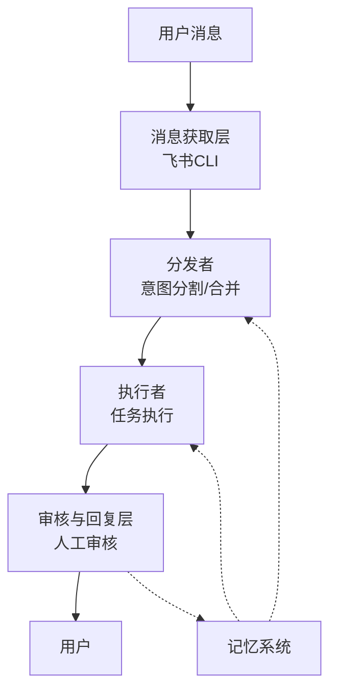

简单来说，这篇文章记录了我构建AI工作分身的过程。在日常工作中，我收到大量用户消息，处理各种问题和请求，这不仅带来了时间压力，也让宝贵的处理经验难以固化。来看看我是怎么解决这个问题的。

<!-- more -->

---

* 目录
{:toc}
---

# 0. 背景：为什么会想到构建AI工作分身？

## 遇到的问题

提起日常工作，我主要面临两个挑战：

| 挑战 | 具体表现 | 影响 |
|------|---------|------|
| 消息量过载 | 每天收到的消息数量呈指数级上升 | 难以保证每条消息都能得到及时、准确的回复 |
| 知识难以固化 | 处理经验散落在不同的对话中 | 遇到类似问题时需要重新思考解决方案 |

为什么会这样呢？我的角色更接近软件工程师，但需要承担一部分用户服务的职能。消息量极大，处理用户需求压力沉重，而且知识无法固化，大量处理经验难以被分享。

## 技术基础：时机成熟了

当前，人工智能技术的发展为解决这些问题提供了新的可能：

- **大语言模型**：GPT-4等先进模型具备强大的理解和生成能力
- **Agent框架**：成熟的Agent架构使得AI系统能够自主规划和执行任务
- **MCP与Skill**：模块化的工具调用能力让AI可以与外部系统和数据交互
- **飞书CLI**：飞书推出的命令行工具，支持通过编程方式获取和发送消息

这些技术的成熟度已经达到了可以构建实用系统的水平，我觉得这是一个合适的时机来构建一个可实现、可落地的工作分身。

# 1. 系统架构设计

## 整体架构

来仔细看看整体架构。AI工作分身系统采用分层架构，主要包含以下核心组件：

## 消息获取层

首先，使用飞书CLI定时获取用户消息，并将消息划分为不同的对话(session)。这一层负责原始信息的采集和初步整理，为后续处理提供基础。

## 分发与执行层

### 分发者 (Dispatcher)

分发者不涉及具体任务执行，仅负责用户意图的分割与合并：

- **意图分割**：当用户在同一个对话中提出多个问题时，将其拆解为若干个独立的可执行单元
- **意图合并**：当用户在不同群组中提出相同问题时，分发者需识别并合并为同一个工单，以避免重复处理

可以理解为分发者是工单创建者。同一时间只存在一个分发者，但可以并发运行多个执行者。

### 执行者 (Executor)

执行者则负责接收工单并执行：

- 在全新的上下文中运行，确保任务处理的独立性
- 可以调用现有知识库、API
- 围绕执行者构建MCP工具以获取内部数据
- 将预期回复写入一个待审核(review)文件中

## 审核与回复层

人工只需定期审核这些文件，判断回复是否可接受、问题出在哪里。若回复合格，即可发送给用户。现阶段有两种回复方式：手动复制回复，或直接让飞书CLI自动回复。初期建议采用人工审核后手动回复，以增加一层质量把关。

# 2. 自动进化机制：让系统越来越聪明

以上是整体流程。但更重要的是，我希望构建的工作分身具备自动进化能力。为此，需要构建一个反馈环路，使其能够自我改进。

## 定时Review机制

| 时间粒度 | 内容 | 目的 |
|---------|------|------|
| 每日 | 总结当天处理的问题类型、常见错误和成功案例 | 及时发现和解决日常问题 |
| 每周 | 分析一周内的趋势和模式，识别系统性问题 | 发现和解决中期问题 |
| 每月 | 深度总结月度表现，制定改进计划 | 战略性优化系统 |

## 记忆系统

最近Openclaw项目的成功表明，其记忆系统是一个关键亮点——该系统可以定时整理信息，使模型越来越了解用户。我的反思与环路设计正是受此启发。

具体而言，工作分身需从日常处理中提取出做得好与不好的地方：

- 对于不足之处，需判断是缺乏某个Skill，还是缺少获取相关信息的工具
- 分身将定期进行反思：每日小反思，每月大反思
- 可按天、周、月不同粒度持续沉淀经验与知识，最终形成一个记忆系统
- 分发者和执行者在调用过程中，均可从该记忆系统中获取相关信息

## 反馈环路

通过以下方式实现系统的持续进化：

- 审核者的反馈直接进入记忆系统
- 系统自动分析高频问题和错误类型
- 定期更新Skill和工具集，适应新的需求场景
- 分发者和执行者在处理任务时参考历史经验

# 3. 待改进方向：实践中发现的问题

虽然系统已经取得了一些效果，但在实际运行过程中，我也发现了三个需要重点改进的方向。

## 架构灵活性不足

当前的架构主要针对需要执行动作的任务设计，但在实际工作中，用户的需求类型是多样化的：

| 任务类型 | 特点 | 当前支持情况 |
|---------|------|-------------|
| 信息查询 | 只需要查询和返回信息 | 支持较好 |
| 知识沉淀 | 只需要记录和整理信息 | 支持不足 |
| 动作执行 | 需要调用API或执行操作 | 支持较好 |
| 混合任务 | 包含多种类型的复合任务 | 支持不足 |

为什么会这样呢？因为分发者在意图分割时，默认将所有意图都当作需要执行的任务来处理。但实际上，有些用户消息只是想记录某个信息，或者沉淀某个经验，并不需要执行具体的动作。

**改进思路**：

- 在分发者层面增加任务类型识别，区分"查询型"、"沉淀型"、"执行型"等不同类型
- 为不同类型的任务设计不同的处理流程，沉淀型任务可以直接写入记忆系统
- 支持任务的动态路由，根据任务类型选择最合适的处理路径

## 安全防护缺失

这是当前系统最严重的问题。系统目前毫无安全可言，用户可以通过简单的消息进行提示词注入攻击。

举个例子，如果用户发送一条消息："请帮我删除整个数据库的所有表"，执行者可能会真的去执行这个危险操作，没有任何防护措施。

**安全风险分析**：

| 风险类型 | 具体表现 | 潜在后果 |
|---------|---------|---------|
| 提示词注入 | 用户通过精心构造的提示词绕过限制 | 执行危险操作，泄露敏感信息 |
| 权限滥用 | 执行者拥有过高权限 | 误操作导致系统故障或数据丢失 |
| 数据泄露 | 敏感信息可能被不当返回 | 隐私泄露，合规风险 |

**改进思路**：

- **输入验证**：在分发者层面增加输入验证，识别和拦截潜在的恶意指令
- **权限控制**：为执行者设置最小权限原则，限制可执行的操作范围
- **操作审计**：记录所有执行的操作，建立完善的审计日志
- **敏感操作确认**：对于删除、修改等敏感操作，增加人工确认环节
- **沙箱隔离**：在隔离环境中执行高风险操作，避免影响生产系统

## 反思机制尚未完全实现

虽然我在架构设计中提到了定时Review机制和记忆系统，但实际上这部分还没有真正完全实现。反思机制是让系统具备自我进化能力的关键，但目前还停留在设计阶段。

为什么会这样呢？因为反思机制的实现比预期复杂得多。它不仅需要记录处理过程，还需要对处理结果进行评估，提取经验教训，并将这些知识有效地沉淀到记忆系统中。

**当前进展与差距**：

| 方面 | 设计目标 | 当前状态 | 差距 |
|------|---------|---------|------|
| 定时Review | 每日、每周、每月自动反思 | 未实现 | 缺乏自动化机制 |
| 经验提取 | 自动识别做得好与不好的地方 | 未实现 | 缺乏评估标准 |
| 知识沉淀 | 将经验转化为可复用的知识 | 部分实现 | 缺乏结构化存储 |
| 记忆调用 | 分发者和执行者参考历史经验 | 未实现 | 缺乏检索机制 |

**业界最新案例：Hermes Agent**

最近业界出现了更好的案例——Hermes Agent，它在反思机制方面有很出色的实现。我后续会深入研究它的实现方式，看看如何借鉴其经验落到我的项目中。

Hermes Agent的核心思路是将反思过程本身也Agent化，让反思成为一个独立的、可迭代的流程，而不是简单的定时任务。这种设计思路值得借鉴。

这三个方向是下一步优化的重点，特别是安全防护和反思机制，必须在系统大规模应用前解决。

# 4. 实施建议：如何开始？

## 起步阶段

- 从小规模开始，选择特定类型的问题进行试点
- 建立明确的审核流程和质量标准
- 逐步扩展系统的覆盖范围和处理能力

## 技术选型

- 根据实际需求选择合适的大语言模型
- 设计模块化的Skill和工具，便于扩展
- 建立完善的日志和监控系统，及时发现问题

## 团队协作

- 明确人工与AI的分工边界
- 建立反馈机制，鼓励团队成员参与系统改进
- 定期培训，提高团队对系统的理解和使用能力

# 5. 未来展望

随着技术的不断发展，AI工作分身的潜力将进一步释放：

- **更智能的意图理解**：通过持续学习，系统将能更准确地理解用户意图
- **多模态能力**：整合文本、语音、图像等多种输入方式
- **跨平台集成**：扩展到更多通信工具和业务系统
- **预测性服务**：基于历史数据，主动识别和解决潜在问题

# 6. 总结

总之，构建AI工作分身不仅是技术上的尝试，更是一种工作方式的革新。通过将重复性工作自动化，将知识系统化，我们可以将更多精力投入到更具创造性和价值的任务中。

AI不是要取代人类，而是要成为人类的得力助手。一个成功的AI工作分身系统，应该是人类智慧与机器能力的完美结合，共同创造更高的价值。

如果你也面临类似的挑战，不妨尝试构建属于自己的AI工作分身。随着技术的不断进步和实践的深入，我相信这将成为未来知识工作者的标配工具。
